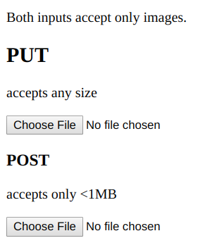
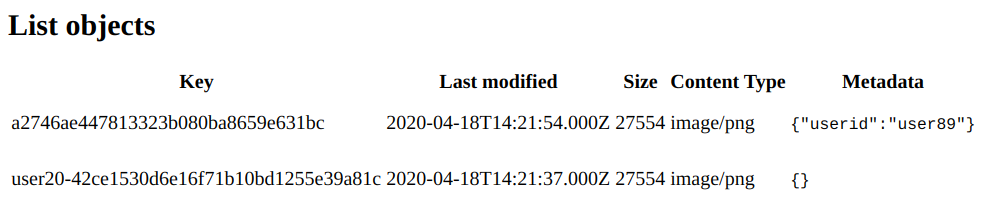

# This is demonstration code to show how PUT and POST signed URLs work

To learn more about how to upload files using S3 signed URLs read these articles:

* [How to use S3 PUT signed URLs](https://advancedweb.hu/how-to-use-s3-put-signed-urls/)
* [How to use S3 POST signed URLs](https://advancedweb.hu/how-to-use-s3-post-signed-urls/)
* [Differences between PUT and POST S3 signed URLs](https://advancedweb.hu/differences-between-put-and-post-s3-signed-urls/)

## Requirements

* terraform

## How to use

* ```terraform init```
* ```terraform apply```
* go to the resulting URL. On the page, use the two file inputs to upload images and refresh the page to see the object list on the bottom
* ```terraform destroy```

## How it works

The two file inputs work differently, the top one using PUT requests and the ```getSignedUrlPromise("putObject",...)``` call, while the other one uses POST ones with ```createPresignedPost(...)```.



PUT URLs has some shortcomings, which can be tested using these inputs:

* The maximum file size can not be set, while POST URLs can have a range of accepted bytes
* The content type must be known when the URL is signed, so the browser must send it to the backend, while for POST URLs a prefix can be enforced
* No metadata can be added to the object, so things like the uploading user must be part of the key

The generated key and the metadata can be inspected with the object list on the bottom of the page:



The bottom object is uploaded using the PUT method, and the userId (a generated dummy string, unique for each upload) is part of the object key. The code that sets it is [here](https://github.com/sashee/s3_upload_signed_urls/blob/master/index.js#L61).

The top object used the POST method. The key is entirely random and the metadata associated with the object contains the userId. The backend code that handles this is [here](https://github.com/sashee/s3_upload_signed_urls/blob/master/index.js#L77).
